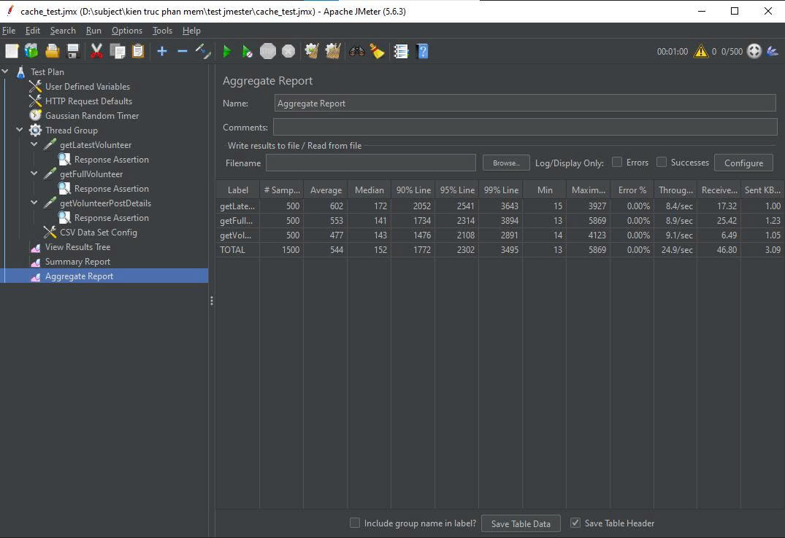
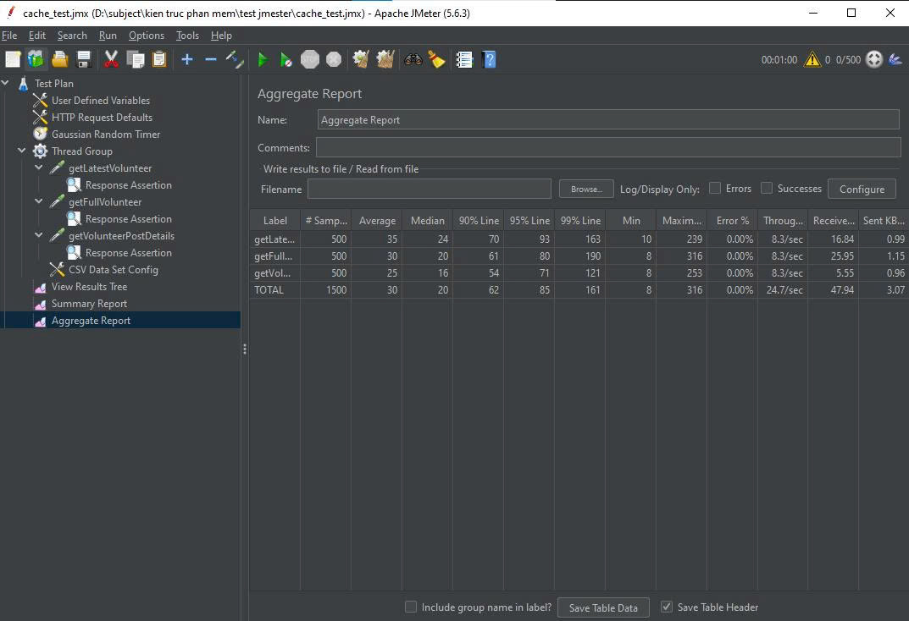
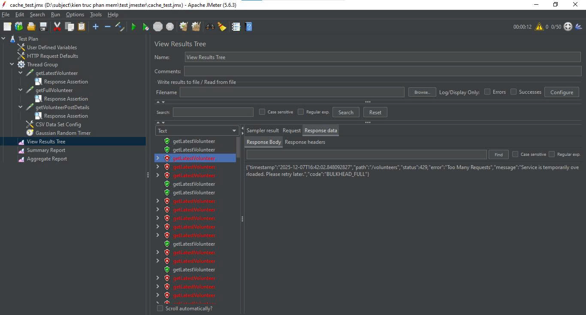

# VolunteerHub2
- Bài tập lớn môn Kiến trúc phần mềm INT3105
- Bản gốc: https://github.com/nahidbinwadood/Volunteer-Management-System
- Bản gốc sau chỉnh sửa (để so sánh): https://github.com/Kingdom-gh/VolunteerHub2/tree/checkpoint

## Nhóm 15:
- **Đỗ Đức Thắng** - 23020158
- **Đỗ Trung Kiên** - 23020085
- **Lương Vũ Thế** - 23020159
- **Đầu Hồng Quang** - 23020135
## Chức năng của bản gốc:
- Đăng ký - Đăng nhập sử dụng xác thực từ Firebase
- Thêm, sửa, xóa sự kiện
- Đăng ký sự kiện
- Xem thông tin sự kiện

## Cài đặt và chạy dự án
```bash
# Clone
git clone <this-repo-link>

# Chạy backend
# Cần chạy docker engine, và cần setup cho vài container
cd backend_2
docker compose build
docker compose up -d

# Chạy client
# Tạo file .env và thêm các biến môi trường Firebase
cd client-side
npm install
npm run dev
```


## Các cải tiến
### 1. Traefik Load Balancer
- Load Balancer tự động phân phối traffic đến các instance đang hoạt động tốt
- Các instance liên tục được health check bằng cách gọi API :
    - healthz(kiểm tra instance còn sống) 
    - readyz(kiểm tra kết nối đến database, redis, mq, ...) 

-> nếu không hoạt động -> Load Balancer loại instance ra khỏi danh sách các instance có thể nhận request

=> Horizontal scaling, tăng khả năng chịu lỗi, phục hồi
### 2. Rate limiting 
- Rate limiting được cấu hình trực tiếp trên traefik, chặn các request spam
#### **Cấu hình Rate Limit**
- **Average limit:** 200 requests/second  
- **Burst:** 100 requests  
- **Scope:** theo IP address  

=> Giảm thiệt hại từ DoS ở tầng Gateway, ngăn backend bị quá tải
### 3. Thêm ORM, index cho DB

Cũ: Sử dụng truy vấn SQL với PrepareStatement

Mới:
- Thay thế truy vấn SQL thuần bằng ORM (Hibernate/Jpa)
- Index cho các bảng có lượng truy vấn hay sắp xếp cao

=> Tăng tốc độ cho những truy vấn đọc hay được sử dụng, tăng bảo mật, chống SQL injection, độc lập cơ sở dữ liệu

### 4. Thêm logic UI, UX
- Bổ sung thông báo kết quả đăng ký đến người dùng, và số đăng ký mới đến người tạo post
- Cho người đăng bài kiểm duyệt đăng ký đến post
- Cải thiện logic duy nhất 1 đăng ký của 1 người dùng đến cùng 1 post
- Thêm hình ảnh mặc định sinh động theo category cho post không có ảnh

=> Logic nhất quán, tránh rác cơ sở dữ liệu, cải thiện trải nghiệm người dùng

### 5. Thêm phân trang và cache theo page number
- Cũ: gửi toàn bộ dữ liệu có trong database
- Mới: phân trang lấy dữ liệu 10-15 bản ghi với mỗi api truy vấn đọc dữ liệu
 
=> Tránh lỗi OOM và giúp người dùng không cần chờ tất cả dữ liệu,

### 6. Thêm RabbitMQ xử lý bất đồng bộ request
- Tách thao tác xử lý nặng (như gửi thông báo, lưu cơ sở dữ liệu) được xử lý sau
- Dùng unique constraint để đảm bảo 1 bảng duy nhất 1 cặp gmail và postId
- Dùng idempotency  để ghi nhận duy nhất 1 request được tạo bời người dùng
- Kết hợp hai cơ chế retry, retry ngay tại ứng dụng (fast attempts) và retry có delay do broker (TTL + dead-letter) để giảm tải và thử lại sau khoảng thời gian.

=> Tăng độ tin cậy, bảo vệ dữ liệu đăng ký và tránh tải đột ngột.

### 7. Redis cache
- Nhiều truy vấn đọc đến database tốn tài nguyên vì phải thực hiện nhiều lần.
- Tăng latency và tải trên DB khi traffic cao.
- Lưu kết quả truy vấn vào Redis (in-memory) để trả ngay khi có cache-hit.

=> Cache trả nhanh hơn database





### 8. Retry pattern
- Lỗi tạm thời (transient DB error, timeout) khiến request thất bại ngay lập tức.

=> Tăng tỉ lệ thành công cho lỗi tạm thời, nhiều thao tác sẽ thành công nếu thử lại.

### 9. Bulkhead pattern
- Một loại tác vụ có thể chiếm hết thread pool khiến các request khác trong cùng service không thể xử lý được.
- Khi một luồng nghiệp vụ bị quá tải, nó kéo theo các luồng khác làm tăng latency/timeout trên toàn hệ thống.
- Nếu không từ chối sớm, request sẽ xếp hàng đợi và làm giảm khả năng hệ thống hồi phục nhanh.

=> Dùng bulkhead semaphore để giới hạn số cuộc gọi đồng thời cho từng nghiệp vụ. Thay vì cho request chờ vô hạn hoặc chiếm tài nguyên, từ chối ngay với mã lỗi rõ ràng (429)



### 10. Giám sát hệ thống (Telegraf - Prometheus – Grafana)
- Telegraf là collector gom system metrics (cpu, ram, disk,...) của container docker
- Prometheus thu thập và lưu trữ metrics từ backend, telegraf
- Grafana lấy nguồn dữ liệu từ Prometheus và trực quan hóa thông qua các bảng, biểu đồ,...

=> Cải thiện Observability, dễ theo dõi tình trạng toàn hệ thống theo thời gian gần thực.
=> Giảm thời gian phát hiện lỗi, debug


